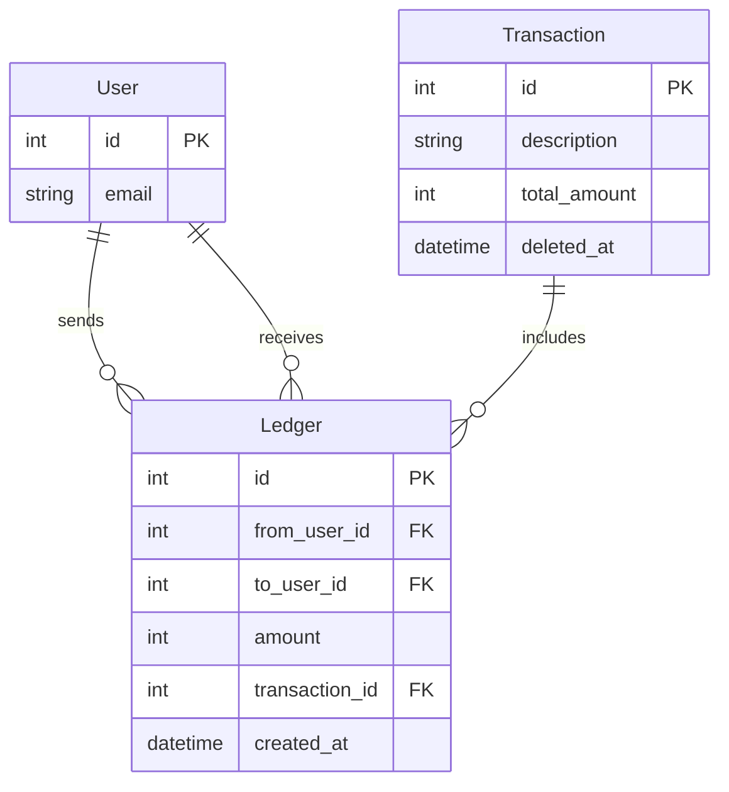

<p align="center">
  <samp>
    <a href="https://subh.me/">website</a> &middot;
    <a href="https://www.linkedin.com/in/subhrashisdas/">linkedin</a> &middot;
    <a href="https://github.com/subhrashisdas/">github</a>
  </samp>
</p>

# Splitwise

Keep track of shared expenses and balances with housemates, trips, groups, friends, and family.

## Assumptions

1. **Simplified Currency Handling**: Amounts are treated as integers in micro units (e.g., cents).
2. **No Authentication**: No security or authentication mechanisms are in place.
3. **Open Transactions**: Anyone can create transactions.
4. **Clearing Balances**: Clearing a user’s balance resets all +ve and -ve balances to zero.
5. **Immediate Processing**: Transactions are processed immediately.
6. **Percentage Rounding**: Percentages are rounded to the nearest natural number.

## Deployment Instructions

- **Backend**: [Live Deployment](https://sd-splitwise.vercel.app/)
- **API Documentation**: [ReDoc](https://sd-splitwise.vercel.app/redoc)
- **YouTube Video**: [Overview](https://www.youtube.com/watch?v=8AQ0MXEdQQ0)

## Installation Instructions

```bash
git clone git@github.com:subhrashisdas/splitwise.git
cd splitwise
pip install -r requirements.txt
export PYTHONPATH=$(pwd)
export DATABASE_URL=sqlite:///./splitwise.db
fastapi dev main.py
```

## Data Model



## Deployment Checklist

1. **Codebase**: Single version-controlled codebase.
2. **Dependencies**: Managed via `requirements.txt` or similar.
3. **Configuration**: Stored in environment variables.
4. **Backing Services**: Configured via environment variables.
5. **Build, Release, Run**: Automated processes and versioned artifacts.
6. **Processes**: Stateless and concurrency-friendly.
7. **Port Binding**: Listen on a port; use service discovery if needed.
8. **Concurrency**: Managed with process managers; conduct load testing.
9. **Disposability**: Quick startup/shutdown and graceful shutdown.
10. **Dev/Prod Parity**: Maintain similar environments; automate and test thoroughly.
11. **Logs**: Centralized logging; avoid local log storage.
12. **Admin Processes**: Run as one-off processes; automate where possible.
13. **Automatic Migrations**: Manual migrations to avoid unintended schema changes.

## Code Review

1. **Core Logic for Transactions**: Modular and predictable transaction handling.
2. **Rounding Handling**: Rounding errors assigned to the last user in percentage splits.
3. **Payload Validation**: Extensive validation to prevent incorrect/malicious inputs.
4. **Update Logic**: Soft-delete old transactions and create new ones to maintain history.
5. **Database Flexibility**: Supports MySQL, PostgreSQL, and SQLite.
6. **Optimistic Amount Assignment**: Handles all cases including partials.

## Improvements

1. **Cache User Balances**: Improve performance with caching.
2. **Currency Handling**: Support multiple currency types.
3. **Sharding and Scaling**: Consider for scalability.
4. **Enhanced Security**: Implement authentication and authorization.
5. **Asynchronous Processing**: Handle high request volumes efficiently.
6. **Proper Transaction Management**: Ensure data integrity and avoid blocking operations.
7. **Advanced Error Handling**: Develop robust error handling and feedback.
8. **User Interface**: Build a user-friendly interface for transactions and balances.
9. **Comprehensive Testing**: Expand test coverage for reliability.
10. **Knapsack Algorithm**: Optimize ledger allocation.
11. **Pagination**: Implement pagination for list endpoints.

## User Endpoints

### Create a User

**Endpoint:** `POST /users`

**Request:**

```bash
curl --location 'https://sd-splitwise.vercel.app/users' \
--data-raw '{"email": "test_4@gmail.com"}'
```

**Response:**

```json
{
  "id": 5,
  "email": "test_5@gmail.com"
}
```

### Get User Balance

**Endpoint:** `GET /users/{user_id}/balance`

**Request:**

```bash
curl --location 'https://sd-splitwise.vercel.app/users/1/balance'
```

**Response:**

```json
[
  { "user_id": 3, "total_amount": 9000 },
  { "user_id": 4, "total_amount": 9000 }
]
```

### Clear User Balances

**Endpoint:** `POST /users/{user_id}/clear`

**Request:**

```bash
curl --location 'https://sd-splitwise.vercel.app/users/1/clear' \
--data '{}'
```

## Transaction Endpoints

### Create a Transaction

**Endpoint:** `POST /transactions/`

**Request:**

```bash
curl --location 'https://sd-splitwise.vercel.app/transactions/' \
--data '{
    "description": "Office supplies",
    "total_amount": 30000,
    "split_type": "uneven",
    "computation_type": "amount",
    "from_users": [{"user_id": 1, "value": 10000}, {"user_id": 2, "value": 20000}],
    "to_users": [{"user_id": 1, "value": 12000}, {"user_id": 3, "value": 15000}, {"user_id": 4, "value": 3000}]
}'
```

**Response:**

```json
{
  "description": "Office supplies",
  "total_amount": 30000,
  "id": 13,
  "ledgers": [
    { "amount": 10000, "from_user_id": 1, "to_user_id": 1, "transaction_id": 13 },
    { "amount": 2000, "from_user_id": 2, "to_user_id": 1, "transaction_id": 13 },
    { "amount": 15000, "from_user_id": 2, "to_user_id": 3, "transaction_id": 13 },
    { "amount": 3000, "from_user_id": 2, "to_user_id": 4, "transaction_id": 13 }
  ]
}
```

### Create a Transaction with Even Split

**Endpoint:** `POST /transactions/`

**Request:**

```bash
curl --location 'https://sd-splitwise.vercel.app/transactions/' \
--data '{
    "description": "Office supplies",
    "total_amount": 30000,
    "split_type": "even",
    "computation_type": "amount",
    "from_users": [{"user_id": 1}, {"user_id": 2}],
    "to_users": [{"user_id": 1}, {"user_id": 3}]
}'
```

**Response:** 

_Response will depend on transaction processing logic._

### Create a Transaction with Percentage Split

**Endpoint:** `POST /transactions/`

**Request:**

```bash
curl --location 'https://sd-splitwise.vercel.app/transactions/' \
--data '{
    "description": "Office supplies",
    "total_amount": 30000,
    "split_type": "uneven",
    "computation_type": "percentage",
    "from_users": [{"user_id": 1, "value": 60}, {"user_id": 2, "value": 40}],
    "to_users": [{"user_id": 3, "value": 30}, {"user_id": 4, "value": 70}]
}'
```

**Response:** 

_Response will depend on transaction processing logic._

### Update a Transaction

**Endpoint:** `PUT /transactions/{transaction_id}`

**Request:**

```bash
curl --location --request PUT 'https://sd-splitwise.vercel.app/transactions/2' \
--data '{
    "description": "Office supplies",
    "total_amount": 30000,
    "split_type": "uneven",
    "computation_type": "amount",
    "from_users": [{"user_id": 1, "value": 10000}, {"user_id": 2, "value": 20000}],
    "to_users": [{"user_id": 1, "value": 12000}, {"user_id": 3, "value": 15000}, {"user_id": 4, "value": 3000}]
}'
```

**Response:**

```json
{
  "description": "Office supplies",
  "total_amount": 30000,
  "id": 2,
  "ledgers": [
    { "amount": 10000, "from_user_id": 1, "to_user_id": 1, "transaction_id": 2 },
    { "amount": 20000, "from_user_id": 2, "to_user_id": 1, "transaction_id": 2 },
    { "amount": 12000, "from_user_id": 1, "to_user_id": 1, "transaction_id": 2 },
    { "amount": 15000, "from_user_id": 2, "to_user_id": 3, "transaction_id": 2 },
    { "amount": 3000, "from_user_id": 2, "to_user_id": 4, "transaction_id": 2 }
  ]
}
```

## License

© 2024 Subhrashis Das. All rights reserved.
